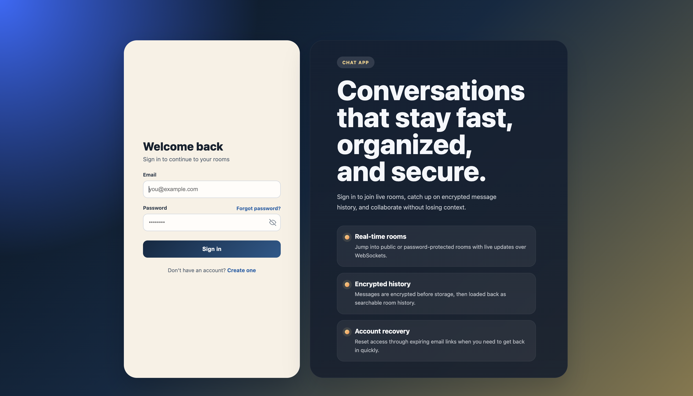
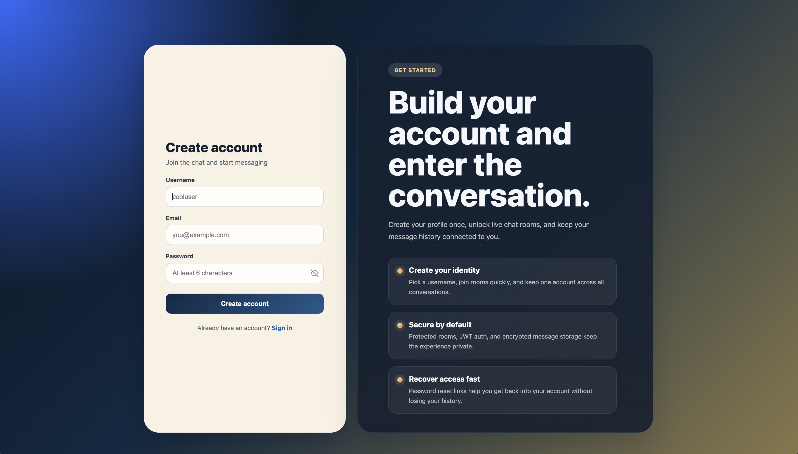
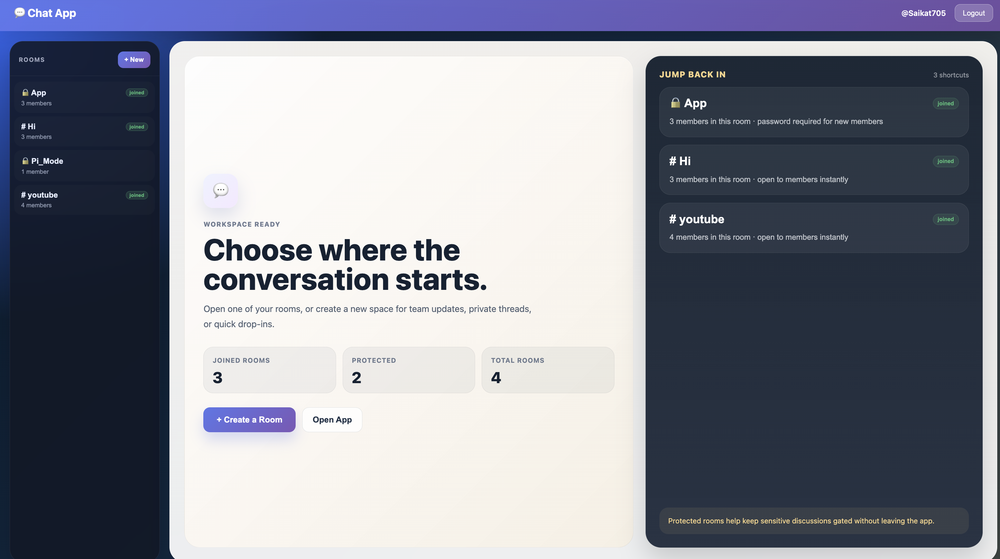
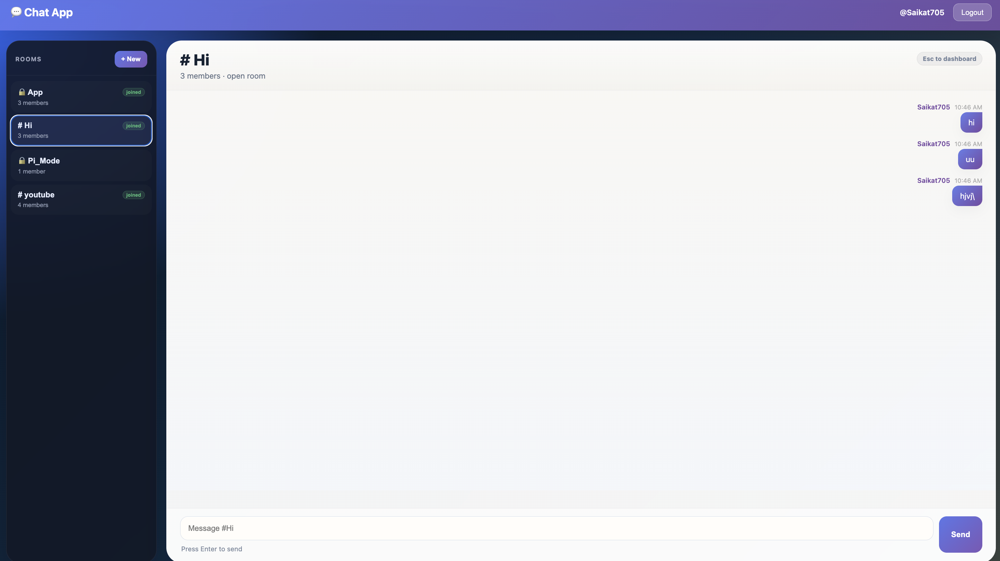
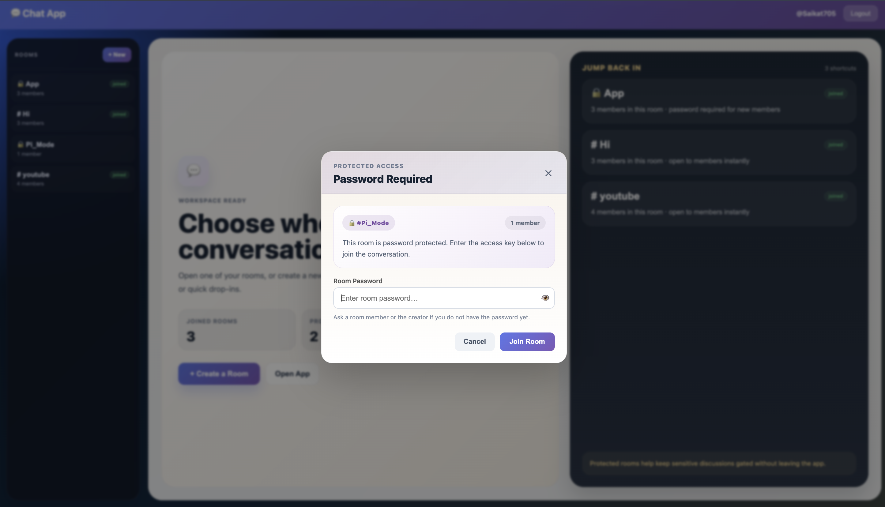

# 💬 Real-Time Chat Application

A full-stack real-time chat application built with Go, React, PostgreSQL, and WebSocket for live room-based conversations.

## 🚀 Features

- Real-time messaging with WebSocket
- JWT-based authentication
- Public and password-protected chat rooms
- Persistent message history with PostgreSQL
- Encrypted message storage
- Typing indicators and room join events
- Password reset flow
- Responsive React frontend
- REST API for auth, rooms, and message history

## 🛠️ Tech Stack

**Backend**

- Go (Golang)
- Gin
- PostgreSQL
- WebSocket (`gorilla/websocket`)
- JWT Authentication
- Bcrypt

**Frontend**

- React.js
- React Router
- Vite
- REST API integration
- WebSocket client

## 📐 Architecture

```text
React Frontend ←→ REST API / WebSocket ←→ Go Backend ←→ PostgreSQL
```

## 📁 Project Structure

```text
chat-app/
├── backend/
│   ├── config/
│   ├── crypto/
│   ├── db/
│   ├── handlers/
│   ├── mailer/
│   ├── middleware/
│   ├── models/
│   ├── .env.example
│   └── main.go
├── frontend/
│   ├── src/
│   │   ├── api/
│   │   └── pages/
│   ├── .env.example
│   └── vite.config.js
└── README.md
```

## ✅ Prerequisites

- Go 1.21+
- Node.js 18+
- PostgreSQL

## ⚙️ Environment Setup

### Backend

Create `backend/.env` from `backend/.env.example`.

```bash
cp backend/.env.example backend/.env
```

Important variables:

```env
PORT=8081
DB_HOST=localhost
DB_PORT=5432
DB_USER=postgres
DB_PASSWORD=your_db_password
DB_NAME=chatapp
JWT_SECRET=replace_with_a_long_random_secret
MESSAGE_ENC_KEY=your_64_char_hex_key
APP_URL=http://localhost:5173
CORS_ALLOWED_ORIGINS=http://localhost:5173
SMTP_HOST=smtp.gmail.com
SMTP_PORT=587
SMTP_USER=you@gmail.com
SMTP_PASS=your_app_password
SMTP_FROM=Chat App <you@gmail.com>
```

Notes:

- Generate `MESSAGE_ENC_KEY` with `openssl rand -hex 32`
- Leave `SMTP_HOST` blank to use the no-op mailer and log reset links locally
- `CORS_ALLOWED_ORIGINS` accepts comma-separated frontend origins

### Frontend

Create `frontend/.env` from `frontend/.env.example`.

```bash
cp frontend/.env.example frontend/.env
```

```env
VITE_API_BASE_URL=http://localhost:8081
```

## 🏃 How to Run

### Backend

```bash
cd backend
go mod download
go run main.go
```

Backend runs on `http://localhost:8081`.

### Frontend

```bash
cd frontend
npm install
npm start
```

Frontend runs on `http://localhost:5173`.

## 🔌 API Overview

### Auth

- `POST /api/signup`
- `POST /api/login`
- `GET /api/me`
- `POST /api/forgot-password`
- `POST /api/reset-password`

### Rooms

- `POST /api/rooms`
- `GET /api/rooms`
- `GET /api/rooms/:id`
- `POST /api/rooms/:id/join`
- `DELETE /api/rooms/:id/join`

### Messages

- `GET /api/rooms/:id/messages`
- `POST /api/rooms/:id/messages`
- `GET /api/rooms/:id/ws?token=<jwt>`

## 📸 Screenshots

### Login



### Create Page



### Dashboard



### Private Message



### Password Require Popup



## 👨‍💻 Author

Pankaj Roy  
[Portfolio](https://pankaj231123.github.io/) | [LinkedIn](https://www.linkedin.com/in/pankaj-roy705/)
